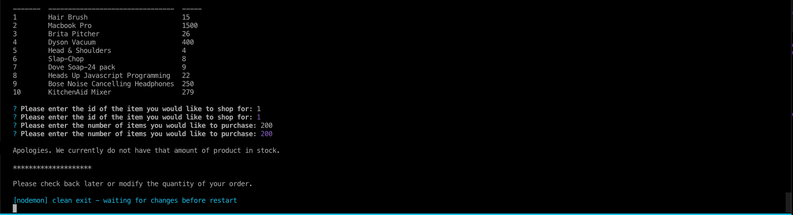

# Bamazon-store-cli-app
CLI Application using Node.js and SQL
# Overview
This application 

## NPM Packages

#### [Dotenv](https://www.npmjs.com/package/dotenv): This package was used to store variables of api keys and passwords that I would like to keep private as I publish my project on GitHub pages, while still having access to the APIs I used in this project.   

<code>npm install dotenv</code> 

## Application Commands and Screenshots

* <code>node app.js</code>
   
By running this command, the application will start with a set of instructions letting the user know how to navigate and perform tasks in the application

* <code>Enter the ID of the item from the table you want to shop for: </code>

* <code>Select number of items you would like to purchase{Item in stock}</code>

* <code>Select number of items you would like to purchase {Item NOT in stock}</code>

